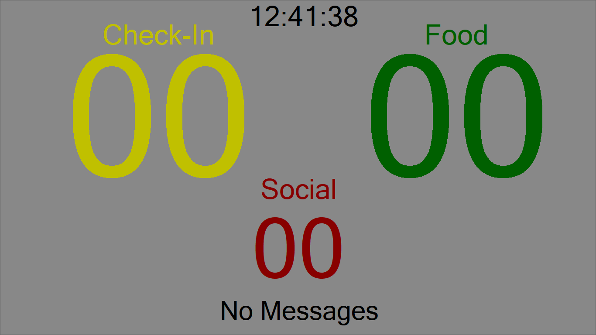
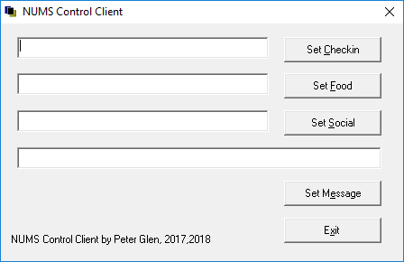

# Giant Number Display (nums)

Giant controllable numbers on screen. Ideal setup is a big screen TV attached to a PC. 

The numbers can be controlled over the LAN with the numscli network client program. (see screenshots)

This project contains the source, the only two files one needs is in the respective 'Release'
directories.
      o .\Release\nums.exe
	  o .\numscli\Release\numcli.exe

One sound file (optional) named notify1.wav will be played when the number display is modified. 
Copy to target or replace it as needed.

Number Screen

Client screen 

